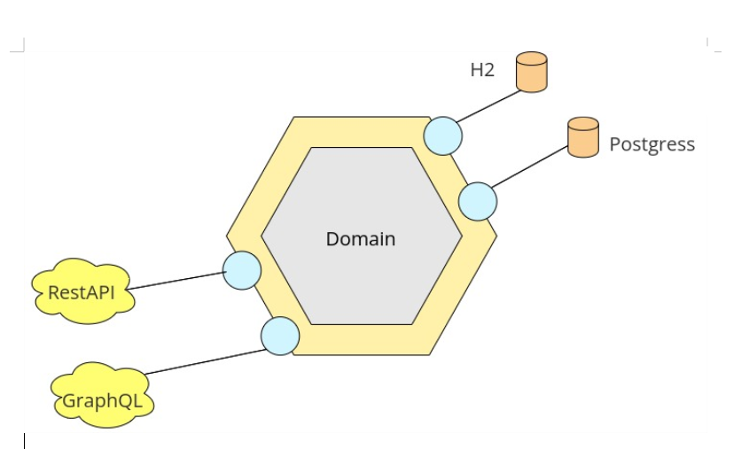

# Simple Book Catalog Program with Hexagonal Architecture

This is a simple book catalog program implemented with the Java programming language. The main goal of this application is to implement hexagonal architecture, in which the focus is mainly on the business of the book catalog by using ports and adapters.

## Overview

### Business

The book catalog program provides CRUD (Create, Read, Update, Delete) operations for managing a book catalog.

### Inbound Ports

The program uses RestAPI and GraphQL as examples of implemented adapters in the inbound ports. Both of them provide the same functionality, but GraphQL is used to showcase the developer's knowledge in this area. The program uses the router function and controller in the RestAPI and GraphQL, respectively. Instead of using the usual exception handler, a special type of exception handler is employed, which inherits from the building Spring class's `WebExceptionHandler`.

### Outbound Ports

The program uses Postgres as a relational database for the online runtime and H2 as an in-memory tool for test cases. In the test case and runtime case, the program automatically uses the H2 database and Postgres database, respectively.


## Tech Stack

The following technologies are used to build the program:

- Java 17
- Maven
- Spring Boot
- Spring WebFlux
- Spring Data
- Spring R2DBC
- Swagger
- Map Struct
- Makito
- Docker
- Docker-Compose

## Project Run

### Not using IDE

To build and run the program, use the `docker` and `docker-compose` commands. Run the `run.sh` file as a superuser to start the program. If you need to change some configuration such as database settings or ports, use the `.env` file provided.

Swagger URL : http://locahost:5050/swagger-ui.html
GraphQL URL : http://localhost:5050/graphql

### Using IDE

To run the program using an IDE, select the Spring Boot run configuration IDE, and then select environment variables with the following text:

```
APP_PORT=6060;DB_HOST=localhost;DB_NAME=postgres;DB_PASSWORD=postgres;DB_PORT=5432;DB_USER=postgres
```

To run the program in unit-test state, use the following command:

```bash
./mvnw clean test
```